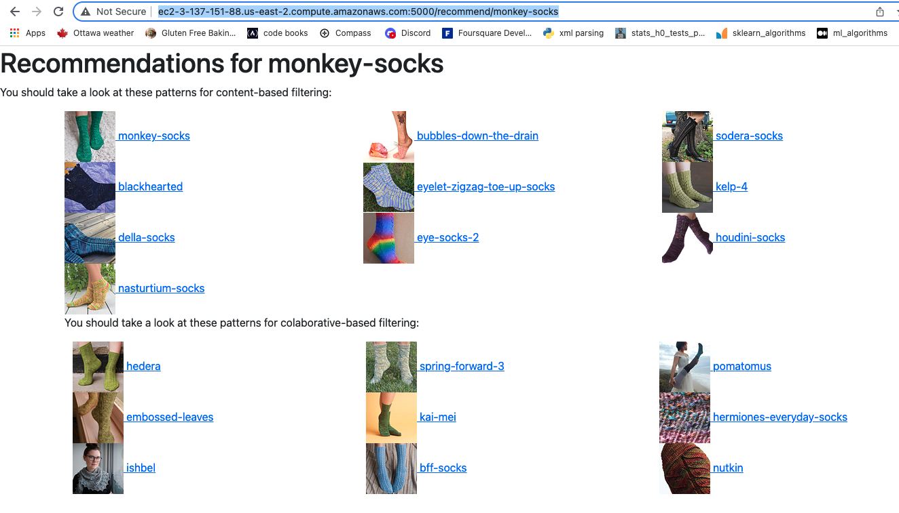
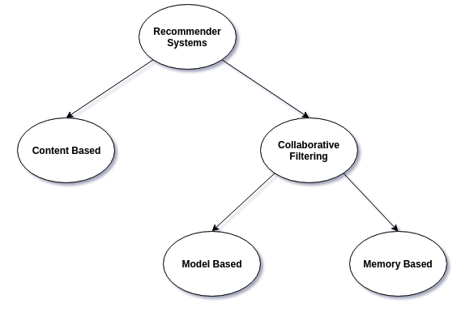
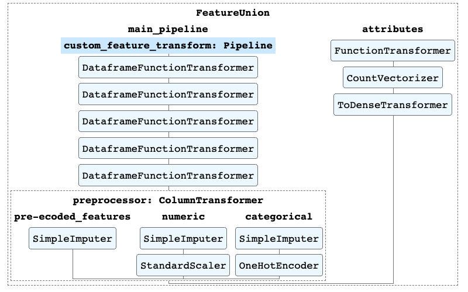

# Ravelry Recommender Engine

### Demo
This is temporarily available [here](http://ec2-3-137-151-88.us-east-2.compute.amazonaws.com:5000/recommend/monkey-socks). 

Change the endpoint ("monkey-socks") to a pattern endpoint found in Ravelry.  For example, https://www.ravelry.com/patterns/library/birds-of-a-feather-14 you would use http://ec2-3-137-151-88.us-east-2.compute.amazonaws.com:5000/recommend/birds-of-a-feather-14

### Probelm:
[Ravelry](https://www.ravelry.com/) has cornered the market in terms online knitting and crochet content. Nearly any pattern can be found in it's database. The website is well laid out with a fabulous search menu - if you know exactly what you're looking for, but if you don't you can get lost for hours trying to dig through the hundreds of thousands of options.  

Knitting is a hobby known for destressing or relaxing. I often find myself paralized with the paradox of choice when browsing for what to work on, and find pattern selection more stressful than it needs to be. 

This project aims to ease this problem; making this pattern selection process easier, by providing pattern recommendations to the user, when given a particular pattern the user enjoyed or likes. It's been found in the popular [jam study](https://faculty.washington.edu/jdb/345/345%20Articles/Iyengar%20%26%20Lepper%20(2000).pdf),that that people buy less with too many options provided to them, and, in the [words](https://www.forbes.com/sites/chunkamui/2011/10/17/five-dangerous-lessons-to-learn-from-steve-jobs/?sh=7f4db0373a95) of Steve Jobs. "A lot of times, people don’t know what they want until you show it to them".

A successful recommender system would increase knitting comminty engagement - which is at the core of the website.  And by overcoming some selection indecision, more projects could be completed.

I focused only on knitting for this recommender engine as it's a hobby I've been practicing for over three decades and more confortable assesing recomendation level of success in that area rather than the other fibre arts of crochet or machine knitting. 

### About Ravelry
[Ravelry](https://www.ravelry.com/) is a free indie-website started in 2007 which supports documenting fiber art projects. Members share projects, ideas, collections of yarn and tools.  Because it's so community driven, nearly any knitting or crochet pattern can be found and reviewed. 
[source](https://en.wikipedia.org/wiki/Ravelry) 

#### Per api agreement:
I will note that this project is not asscoiated with Ravelry. The data used was graciously provided through Ravelry's public [api](https://www.ravelry.com/api#index).

##### Also:
Please note this is still a work in progress! 

### Recommendation Systems
The three main types of recommender systems:

[Source: kdnuggets](https://www.kdnuggets.com/2019/09/machine-learning-recommender-systems.html)

In this project I explored the content based filtering and collaborative filtering.  I plan to combine them for hybrid filtering in the near future. 

## Content Based Filtering

Content based filtering looks at all the features that make up a knitting pattern and compares those to other patterns with similar features. Luckily there's an api to gather some of these features; knitting gauge, needle size, amount of yarn (yardage), and various attributes and categories.

### Data Gathering and Cleaning

As I mentioned anyone can post patterns to Ravelry, there was unclean, semi-structured data, and lots of missing data Also there were api limitations - max 100,000 per query, and 500 results per page (in some cases I had to bring that down to 100 to keep it from timing out), so I had a lot of fun extracting and cleaning creating and paring down the number of these features.  

To streamline the processing, a pipe line was used

The final features can be found below in the data dictionary. 

After the data's cleaned, numerically encoded and processed, recommendations for a particular pattern can be compared using similarity functions. 

Euclidean Distance is affected by the magnitude of the features, and the cosine of the angle indicates similarity (0 being not at all related, and 1 being perfectly similar).

Here are some results for [Sheldon](https://www.ravelry.com/patterns/library/sheldon) the Turtle

* IMAGE to come

## Collaborative Filtering 
Collaborative filtering looks at the behaviour between users and patterns (made projects). Usually this is based on ratings, because because a large proportion people didn’t rate patterns and 97 % that did gave them a 4 or 5 out of 5, this uses a binary or implicit approach which counts the user actually completing a project as the rating.

### Memory Based
I used cosine similarity and kNearest neightbours which has the advantages of requiring ,no-training or optimizaion, but the results are easily explainable, doesn’t scale well and difficult to add new data.  Performance also degrades, the more utlilty matrix is sparse. Next steps for me are to rerun this with Pearson similarity as well. 

* IMAGE to come

#### Limitations 
In order to create a less sparse matrix (performance degrades when the matrix is too empty), I limited the projects to ones that had no less than 600 projects made from it.  Also users with less than 30 projects each were dropped.  This reduced the pattern set to around 3000, which is signifigently less than 180000, so comparing patterns with both filters becomes more difficult.  Next steps are to reduce the project threshold to increase the number of patterns.  However running these as they are takes up quite a bit of memory.  An AWS instance with 15 gB of RAM is insufficent. 

### Model Based
The method I chose for model based filtering was matrix factorization which breaks the user item or pattern matrix into smaller ones.  These smaller matrices represent latent, or more subtle similarities in the patterns. These can be tuned and traing. My next steps here are to tune these models further.  

* IMAGE to come

#### User-Item Recommendations
I felt unconfortable using others' data, but ran the implicit model for my user and was pleasently surprised when I was drawn to the recommendations.  I will definitley be looking into that cardigan next week!

* /results to come

## Next steps:
*  create a hybrid system
* update the app to include yardage and yarn weight so that if you have yarn (say from stash, or reclaimed or thrifted) it will filter results to recommend patterns you may like to try to use that yarn up.  I think this could be really valuable.
* incorporate time sequencing with collaborative filter to capture stages of life (think baby stuff, then kids, then shawls..), also the progression of skill through a knitters journey. (https://keras.io/examples/structured_data/movielens_recommendations_transformers/)
* take this a step further would be to take yarn in your stash (on ravelry) and use that as a recommender (woah - this could be interesting, take colourways that people use commonly together on projects - ML what works best, with what you have, and your preferences, and patterns and separate yardage requirements)
* The content based eucildean metic seems to do okay with Sheldon, but I'd love to explore weighting the features to increase the expression of importance of some of the features.  There was another pattern that had icording, and it threw the result off quite a bit. 

#### Files 
* Details to come

#### Data Dictionary

* Details to come

here are the column names of the data I retreived to 
'pattern_id', 'name', 'name_permalink', 'favorites_count',
       'projects_count', 'difficulty_average', 'difficulty_count',
       'rating_average', 'queued_projects_count', 'rating_count',
       'pattern_type_names', 'pattern_type_clothing', 'photos_url',
       'pattern_needle_sizes', 'pattern_attributes', 'yardage_max', 'yardage',
       'generally_available', 'gauge', 'gauge_divisor', 'free', 'downloadable',
       'categories', 'yarn_weight_description', 'month_avail', 'year_avail',
       'needle_sizes', 'gauge_per_inch'
       
